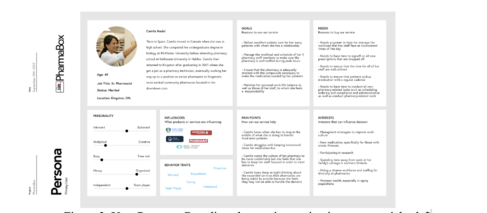
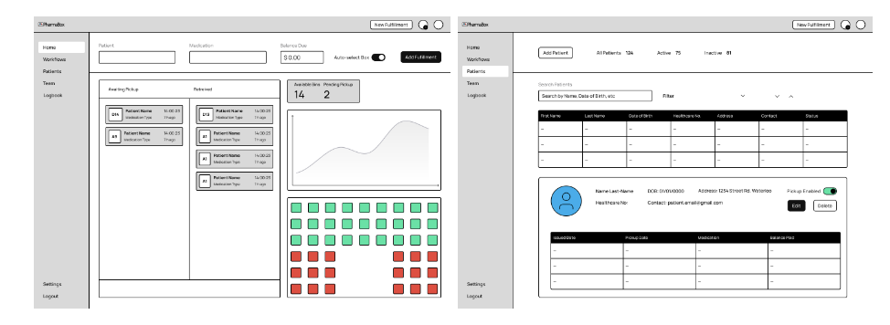
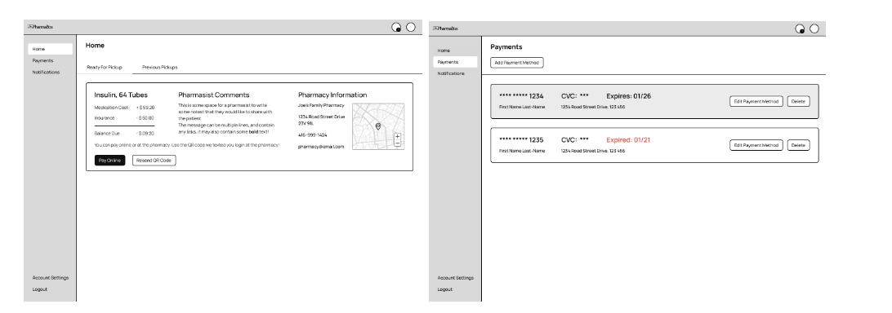

# SYDE 461 PharmaBox

Team 21: Sammy Robens-Paradise, Hussein Nagri, Josh Wilkinson, Aliya Rajwani. November 18th, 2022

_Abstract_ – Understaffing and inefficiencies in Canadian pharmacies have led to long prescription-pickup wait times, and an inability to provide adequate care to patients who require additional assistance. PharmaBox is a solution that reduces pharmacists’ workload by automating prescription pickup in cases where face-to-face interactions are not required. The prototype consists of a patient and admin web application, and a hardware locker box to store prescriptions. An iterative design process was used to implement the low-fidelity prototype. This began with conducting surveys and crafting personas to understand the needs of users and define the requirements of the solution. Next, the software development process involved a bottom-up approach, where the data layer was constructed, followed by the API and frontend. Similarly, the hardware aspect of the project was initiated by building the locking mechanism, followed by assembling the components of the locker box. The first round of user testing was conducted with patients and insights collected during this process will guide improvements to user experience over the next design iteration. The next design iteration will include user testing with pharmacists, the implementation of additional cybersecurity measures to ensure patient information and prescription data are protected, and the synthesis of user feedback collected during preliminary prototype testing.

_Keywords_ – Pharmacy automation, remote healthcare, process optimization, pharmacy analysis

## 1. INTRODUCTION AND IMPACTS

Many patients experience long wait times while picking up prescriptions from retail pharmacies. Waiting is a common frustration that often angers patients due to unforeseen delays [1]. This negative experience is a result of several structural failures at Canadian pharmacies such as understaffing [2]. Pharmacists can only support one patient at a time, leaving people waiting. Healthcare systems in Canada are also expanding the portfolio of care that pharmacists can provide, increasing day-to-day workloads [3]. This is resulting in longer patient-wait times at pharmacies. With the need for prescriptions increasing year by year, a product that will help automate the prescription pickup process will significantly reduce both patient wait times and pharmacy workload [4]. To meet the requirements of our problem space, a platform that is easy for the community to adopt is required. This means developing a simple and self-explanatory product minimizing unnecessary interactions between patients and pharmacy staff. The product would also minimize cashier-related work for pharmacists and pharmacy technicians. As a result, staff members would have additional time to provide higher-quality care and focus on more healthcare-related tasks. These optimizations would lead to an increase in patient satisfaction and decrease the likelihood of prescription abandonment because of reduced wait times. In the optimized process, patients are notified when their prescription is ready for pickup, and then retrieve their prescriptions from a locker using a unique QR code to confirm their identity. By following this process patients will save time by not waiting for automatable customer service transactions.

The service will be financially beneficial for pharmaceutical companies as the increase in the throughput of prescriptions increases revenues. However, this optimization may negatively impact retail pharmacies as fewer people will spend time in the pharmacies, decreasing revenue from non-prescription products [5]. Moreover, this project also has societal effects: A positive societal effect is an increase in prescription pickups, as more people will be inclined to pick up prescriptions, improving population health and decreasing the prescription abandonment rate [6]. The automation of the pickup process could contribute to improper drug use due to reduced pharmacist supervision. To address this concern the solution will only automate repeat prescription pickups.

## 2. PROJECT SCOPE

The project is scoped to consider the patient, and pharmacy practitioners' workflow specific to prescription pickup. In practice this translates to a scope consisting of 1), a pharmacy-facing prescription creation, and management system, allowing pharmacy practitioners to inform patients that they have a prescription available to be picked up, 2), a patient-facing prescription management system allowing patients to view their prescriptions, verify their identity to retrieve their prescription from the pharmacy in a contactless way, and view their previously picked up prescriptions, and 3), a physical storage box in which the prescriptions are placed by the pharmacy practitioners and retrieved by patients in an asynchronous manner.

The implemented prototype to date consists of 5 connected systems. They are 1) the authentication service provided by the user-management service Clerk [7], 2), The API layer written using the open-source JavaScript runtime Node.js with Express.js, and Next.js [8], 3) a PostgresSQL relational database running on AWS RDS, 4), the user interface (front-end) developed using the open-source JavaScript framework React.js and Next.js [8][9], and finally, 5), the Physical storage box, constructed by the FYDP team, and consisting of “off-the-shelf” hardware components including, a Raspberry Pi, 5V Relay, 12V Solenoid Lock, Breadboard 16x2pt LCD module and 5MP Rasp Pi Camera Module. Consider the systems diagram shown in Figure 1:

Figure 1. Pharmabox Systems Diagram [SRP, 2022]

Software components utilized are all open-source, licenced for commercial, and academic use and the application code is written entirely by the FYDP team. The exceptions to this statement are the user management system “Clerk” which operates on a “freemium” model and Amazon Web Services (AWS) [10][11] for which the FYDP team is not responsible. A similar constraint applies to Amazon Web Services relational database service: RDS. Given the prototype scope, AWS comes at a minimal cost and scales linearly with storage requirements [12]. We decided to use Clerk and AWS rather than creating our own authentication and database infrastructure because both of these services can take significant amounts of time to implement and Clerk and AWS already provide SOC 2, HIPAA and GDPR compliance–significant regulatory hurdles for custom implementations. The integration of both AWS and Clerk into the system did, however, require significant development efforts on behalf of the FYDP team.

While the aforementioned hardware components were purchased as “off-the-shelf” the FYDP team was and is responsible for the engineering design of the hardware, its respective assembly as well as the design of the physical locker box prototype this involved extensive hardware testing, soldering and hardware assembly. The physical low-fidelity locker box was laser-cut from medium-density fiberboard and was assembled by FYDP team members using off-the-shelf fasteners and glue.

## 3. ENGINEERING METHODS OF ANALYSIS AND DESIGN

_Backend Architecture and Design_

The first stage in the development of the software stack employed a bottom-up approach beginning with the data layer. This meant understanding data relationships, the types of data that are relevant and needed to be stored, and how this data will be structured. This approach was chosen following data-driven design principles which facilitate the development of backend, API, and frontend layers once the structure of the data is first understood [13]. To derive the required data-types, the team conducted three brainstorming sessions. The needs of primary users, pharmacists and patients, were assessed to understand which features of the application were required and then relevant architecture requirements was derived from that. User journey flows for both patients and pharmacists were utilized to understand the required processes and systems to achieve an ideal user experience. These user-journey flows helped further derive the information that needed to be stored and the data structures that arose to facilitate this goal. To summarize, our backend architecture design process was initiated using a top-down user-focused analysis of our problem space to understand the needs and requirements of the design. Once these areas were identified, the fundamental data structures required and data models could be built and the implementation of the backend, API, frontend, and hardware for the prototype could then be built. For instance, when analyzing the prescription pickup flow for a patient, we identified the need for a “Location” data structure to represent a pharmacy’s address, and contact details, and have pharmacists associated with the location. “Staff/Pharmacist” is the next logical data structure to be derived, and are special user accounts that are tied to location. From there, “Patient” and “Prescription” objects are logical next steps. It can be seen how analyzing the problem from the user journey/experience perspective reveals the data models necessary.

With the data model constructed, the API Layer was designed. There are many tools designed to handle a wide range of applications. Popular frontend frameworks like React.js are often paired with the user’s choice of backend infrastructure There are also full-stack frameworks like Ruby on Rails, Django, and Next.js for server-side rendered JavaScript applications. When deliberating on the framework to use, development speed, supported libraries, maintainability, and ease of development were considered during the team’s decision-making process. The backend language was chosen to be Typescript–a statically typed implementation of JavaScript, for its fast development speed due to it being statically typed which allows for many errors to be caught in advance. A close contender was Python, however, using Typescript left the door open for frameworks like Next.js.

_Front End Architecture Design_

During the design synthesis phase of the iterative design process, UI mockups for the frontend were designed to illustrate workflows for pharmacists, and prescription creation. When deliberating on frontend frameworks, React.js was highly preferred. This was due to its flexibility and maturity in the industry. Using React.js also helped decrease development time as team members had previously utilized the framework. Grommet was also selected as the component library due to its broad range of available components, optimized for Next.js server rendering, and mobile-responsive components.

Application rendering strategies were also heavily considered. Traditional single-page React applications are client-side rendered. This means the necessary code is sent to the browser on the initial request, and data is subsequently fetched via AJAX HTTP requests. Server-side rendered content differs in that each page is generated on the server and then sent to the client [14]. When analyzing the difference and common industry approaches towards both solutions, we also learned of a hybrid approach popularized by Next.js which server-renders the initial page load and then allows the application to run on the client providing fast page load performance, and responsive feeling applications thereafter. Another benefit Next.js provided, was the integration of an Express (Node.js) backend server with the frontend, easing API route design. What sealed our decision to use Next.js was the native Vercel deployment support. Vercel hosts the frontend and backend code for free with a suite of developer-friendly features. As a result, Next.js was chosen as the application framework.

The primary form factor for the user-facing the frontend was a web application. The development of a mobile app was also considered, however, we found a mobile-friendly web app to be the most flexible.

_Web Application Testing Methodology_

Application testing consisted of manual front-end, and back-end validation testing, as well as automated continuous integration/deployment tests (CI/CD) checking for syntax and logical errors in the code before code, is merged. For instance, when the ability to add prescriptions was added, each team member tested the creation flow and verified a prescription was properly created in the database. In the future, as the code base grows the team will write unit, and integration tests to automatically test the functionality of existing systems ensuring no regressions are inadvertently caused.

_Firmware and Hardware Design_

The firmware and hardware were designed using requirements derived from user journey maps personas and survey results. In particular, the prescription pick-up process at the physical lockers had to be: convenient, quick, intuitive, and sanitary in accordance with synthesized engineering requirements. In order to achieve these tenants, the team brainstormed methods to meet each requirement. For convenience, the lockerboxes had to be easily accessible and require less than 3 steps to open, this would encourage users to use this solution instead of waiting in line, reducing wait times. The solution also had to be quicker than the average wait time at the pharmacy, this would incentives users to use the platform over waiting and help to process pickups at a faster rate. This time constraint was set at under 6 minutes in accordance with the mean wait time found during user surveys. The firmware and hardware design have to be intuitive and require minimal explanation in order for the solution to be effective. Ideally, the signs and instructions of the hardware guide users to the correct usage. Lastly, the lockers must be sanitary., this means reducing unnecessary touch points as given its location in a pharmacy, many sick patients will be passing in the area and potentially interacting with it. The hardware/firmware solution we designed to address these concerns involved a series of locker boxes controlled by a 5V Solenoid lock, connected to a central “Box Hub” which housed a Raspberry Pi that would sync the Lockerbox state with the backend via the API, control the lockers, and validate unlocking attempts by patients. The patient validation for unlocking a lockerbox works by scanning a QR code which contains an encoded “one-time password” associated with a particular prescription. The patient simply presents the QR code to the camera module at the Box Hub and after approximately 1-2 seconds the corresponding Lockbox will open allowing them to take their prescription assuming the QR code is valid. This solution is convenient, much quicker than traditional pickup methods, minimizes touch points, and is a single-step procedure. Additional user testing must be done to verify the intuition behind the solution and methods to improve other aspects as well.

_Firmware and Hardware Testing Methods_

In order to test the effectiveness of the firmware/hardware designs and the integrations with the web app, user testing was employed. Students across campus were sampled to participate in testing with the user validation method. This involved instructing user’s to create an account and having a fake prescription created and stored in the Lockerbox for them to open. The team then gained insight from these tests in order to gauge the effectiveness of the design according to the factors of speed, ease of use, and convenience as mentioned in the design section. In particular specific metrics were recorded for each: average unlock time, attempts to scan the QR code, and questions asked during testing. The results of the testing indicated an average unlock time of 12 seconds, with an average of 3 attempts to scan the QR code, and 2 questions asked. Qualitative feedback regarding pain points and areas for improvement revealed more instructions on the box were required, specific indications on where to place the QR code for scanning, and ergonomic factors like a chime to notify when the box was unlocked and a handle to open the door.

## 4. PROJECT OUTCOMES TO DATE

Our team has reached our first three critical milestones in our first cycle of the interactive design process: Needs assessment/synthesis and design/analysis, and testing. During our needs assessment, literature reviews found that addressing inefficiencies in pharmacies affects two main primary user groups which constitute a large portion of the Canadian population. The first group is pharmacists and staff working at community pharmacy facilities, and the second and much larger cohort consists of Canadian patients who are required to pick up prescriptions from community pharmacies, especially at high-traffic locations with increased wait times. As a result, our team targeted these two primary user groups for the development of user personas and user journey maps, designed to help us better understand the needs of these users. User personas were constructed by conducting depth-oriented research into the needs of both pharmacy staff and patients to build empathy with prospective users and proved insightful.

Figure 3: User Persona: Canadian pharmacist serving in a managerial role

Understanding the needs of these users was especially important given that pharmacy practices are moving beyond the traditional medication dispensary model. We found that Canadian pharmacists are often responsible for helping their patients navigate a complex and costly healthcare system. With a high workload, they’re unable to spend adequate time with their patients to meet their healthcare needs. We surveyed 55 pharmacists that revealed similar findings. Of the pharmacists we surveyed approximately two-thirds feel that they do not have enough time to meet the needs of their patients, as shown in Table 1 [16].

Table 1: Pharmacist responses when asked: To what extent do you agree with the following statement? “I feel that I have enough time to adequately address the needs of patients at my pharmacy (place of work)”.

<table>
  <tr>
   <td><strong>Level of Agreement</strong>
   </td>
   <td><strong>Percent of Respondents (<em>n=55</em>)</strong>
   </td>
  </tr>
  <tr>
   <td>Strongly Disagree
   </td>
   <td>23.6%
   </td>
  </tr>
  <tr>
   <td>Disagree
   </td>
   <td>27.3%
   </td>
  </tr>
  <tr>
   <td>Somewhat Disagree
   </td>
   <td>12.7%
   </td>
  </tr>
  <tr>
   <td>Neither Agree No Disagree
   </td>
   <td>5.5%
   </td>
  </tr>
  <tr>
   <td>Somewhat Agree
   </td>
   <td>18.2%
   </td>
  </tr>
  <tr>
   <td>Agree
   </td>
   <td>9.1%
   </td>
  </tr>
  <tr>
   <td>Strongly Agree
   </td>
   <td>3.6%
   </td>
  </tr>
</table>

As part of our needs assessment, we worked to establish the engineering requirements and constraints that would govern our prospective solution. Constraints came most generally in the form of regulatory requirements. For our prototype, the team decided to focus specifically on the regulatory landscape in Ontario. To operate per the Drug and Pharmacies Regulation Act, R.S.O. 1990, c. H.4, section 149 (Drugs) We implemented the following constraints: 1) only medications subject to refills would be applicable for the pickup via the dispensation solution, 2), No drug listed as schedule 1, following the Canadian Federal Controlled Drugs and Substances Act (S.C. 1996, c. 19) were to be retrieved via the pickup location, and 3), the medication dispensation location will be installed at the physical pharmacy location where it can be supervised by a registered pharmacist [17][18].

While regulatory frameworks and laws were critical in establishing the limitations of the solution, to establish engineering requirements we conducted two surveys targeting the primary users of our problem space. Our goal in doing so was to establish a set of requirements that we could leverage to design our solution and then test against, to collect quantifiable results to drive our next design iteration and subsequent higher-fidelity designs. Our patient survey was constructed to give us insight into how prospective patients viewed the viability of our proposed solution of a prescription pickup box, and the extent two which patients felt that we would need to minimize the time spent waiting to pick up a refill prescription for these same patients to consider the solution. The team offered a chance to win a $20.00 Tim Horton’s gift card to incentivize participation, placed posters around campus and posted the online survey to social media. As a result, we received 2,899 responses garnering a diverse set of respondents. Of the respondents, we found that across all user groups surveyed, 85.2% of patients said they were either Very, somewhat or generally likely to use a prescription pickup service. We found that patients under 40 years old indicated that they have a high probability of service usage. Notable outliers were adults older than 65 years old, of which a third indicated that they would never use such a service. These results were encouraging nonetheless as they indicated that most patients would use the service as described. This also allowed us to focus on the usage of an application and website to deliver primary aspects of our service given that such a high number of patients would use the service. Given the disproportionate amount of time pharmacy practitioners spend conducting customer service, reducing customer service-oriented workload by even 20% would translate into time saved for pharmacies. Figure S3 shows the probability of a particular agreement indicator alongside the respective indicator.

Figure 4: Patient Respondents when as “How likely are you to use an automated pick-up locker to pick up your prescriptions?” segmented by age range [SRP, 2022]

Patients also provided their ideal, and typical wait times for services at the pharmacy. These results were positive indicators that there are substantial improvements to be made and allowed the team to target a maximum prescription retrieval time of under 6 minutes as an engineering requirement. Table 2 shows ideal and actual mean reported wait times from patient respondents:

Table 2: Mean, Max and Min reported and actual wait times reported from user survey [SRP, 2022]

<table>
  <tr>
   <td><strong>Wait Times (<em>n</em>=2,899)</strong>
   </td>
   <td><strong>Mean Minimum (Minutes)</strong>
   </td>
   <td><strong>Mean Maximum (Minutes)</strong>
   </td>
  </tr>
  <tr>
   <td>Actual Reported
   </td>
   <td>6.561
   </td>
   <td>9.146
   </td>
  </tr>
  <tr>
   <td>Ideal Reported 
   </td>
   <td>7.675
   </td>
   <td>10.472
   </td>
  </tr>
</table>

Findings from our pharmacy survey also provide critical in establishing engineering requirements to validate our solution. We surveyed 55 pharmacy practitioners and found that almost a quarter spend more than 50 percent of their workday conducting non-pharmacy-related work such as customer service. This provided evidence that there is a significant loss in many pharmacy workflows and potential for optimization. Table 3 shows pharmacy practitioner responses when asked how much time they typically spend conducting customer service and clerical work:

Table 3: Pharmacy Staff Responses when asked: “percent of your time do you think you spend doing customer service/clerical work?” [SRP, 2022]

<table>
  <tr>
   <td><strong>Percentage of Time Doing Non-pharmacy Work</strong>
   </td>
   <td><strong>Number of Respondents (<em>n</em>=55)</strong>
   </td>
  </tr>
  <tr>
   <td>Less than 10%
   </td>
   <td>6
   </td>
  </tr>
  <tr>
   <td>11 to 20 %
   </td>
   <td>4
   </td>
  </tr>
  <tr>
   <td>21 to 30%
   </td>
   <td>12
   </td>
  </tr>
  <tr>
   <td>31 to 40%
   </td>
   <td>10
   </td>
  </tr>
  <tr>
   <td>41 to 50%
   </td>
   <td>10
   </td>
  </tr>
  <tr>
   <td>More than 50%
   </td>
   <td>13
   </td>
  </tr>
</table>

After conducting extensive analysis, we synthesized our findings into a collective proposal to facilitate the refill prescription pickup subject to our engineering constraints and requirements. This proposed solution, shown in Figure 2, consists of a frontend application interface through which patients can view, access and authenticate themselves against an authentication service to retrieve their prescriptions from the drop box. Via this frontend interface, Pharmacists can create prescriptions for pickup, and manage patients and their teams. An authentication service would be used to generate user credentials that would communicate with the front end and a dedicated API layer to secure network requests. This API layer would facilitate creating, updating, reading and deleting between the frontend user interface, a physical prescription pickup lockbox and a secure relational database. Following the synthesis of requirements and constraints, the team designed low-fidelity wireframes depicting the user interface necessary to meet engineering requirements, shown in Figures 7, and 8:

Figure 7: Pharmacy Staff Dashboard (left) and Patient Management Page (right) wireframes [SRP, 2022]

Figure 8: Patient Prescription Pickup Dashboard (left) and Payments management Screen (right) [SRP, 2022]

In accordance with the wireframes, and after receiving feedback and validation from Dr. Faisal, our academic advisor and industry expert, we implemented the frontend application, database, API layer, authentication service, and hardware component consisting of a Raspberry PI computer responsible for managing the locker box, and a locking mechanism to control access to medications. Screen captures of the interface are shown in Figure 9.

Figure 9: Pharmacy Prescription Management Dashboard (Left) and Patient Management Dashboard (right) [SRP, 2022]

We conducted preliminary user testing evaluating the patient workflow where “patients” were instructed to complete the process of retrieving a prescription by scanning a QR on the box code provided to them on a mobile device and then retrieving the prescription from the unlocked box. Eight users participated in the first round of patient testing. Users were then asked to describe their overall experience using the prototype, whether they would use a production-level product adhering to the same workflow they followed, what they found intuitive about the process, what they found confusing and what they would change to improve the service workflow. Results are shown in Figure 10

Figure 10: Overall User Testing Experience (Left), and Likelihood of Using Production Version on a Scale of 1 to 5 Where 5 is Extremely Likely (Right) [SRP, 2022]

## 5. CHALLENGES AND CONCLUSIONS DRAWN FROM OUTCOMES TO DATE

Needs assessment research found that while the impacts of high patient wait times and pharmacists' increasing workload are recognized, and existing solutions have been implemented attempting to address these challenges. these solutions have either not been widely adopted because of their inefficiencies, or do not address the Canadian market. Existing attempts to address the problem fail to address the needs of patients and pharmacy practitioners, leaving a gap in the Canadian healthcare market and an opportunity to improve patient care.

While our initial timeline indicated that we were to begin user testing with our prototype on November 1st, 2022 the team did not meet this deadline for two reasons. The first pertains to the state of the prototype. When we initially developed our user testing plan, we set an ambitious goal with respect to the fidelity of the solution that we wanted to subject to testing. This was done to ensure that we could collect substantial and useful feedback based on a prototype as close as possible to our proposed solution in terms of workflow. We underestimated the work required to achieve this level of fidelity and as a result, we were not in a position to test the prototype by our initial target. The steps we have taken to ensure this will not persist in the future is setting more realistic expectations for goals we want to get done. For example, we created a progress board to have tickets that we will take during the week. These tickets help make everyone aware of the work that is being completed, as well as help set expectations for the progress the team will make.

The second challenge was the availability of our target testing location, the Campus Pharmacy at the Student Life Center. Due to the pharmacy’s extremely busy schedule, they were only available to allow user testing after November 18th, 2022, forcing an inevitable delay in our user testing process. The steps we have taken and continue to take to address this challenge is keeping better communication with the pharmacy. This will help make sure that we are able to test on certain days, by giving the pharmacies a well in-advance notice.

Other challenges that come to mind revolve around the security of our project. In terms of the physical prototype, it will reside within the pharmacy so staff will be able to monitor the product to assure nothing is being broken into. However, conclusions that arose from the development of the product revolved around software security. Initially, the team had trouble with implementing authentication for our backend API endpoints. This stemmed from choosing different ways to authenticate incoming requests such as using API tokens, using an authentication library, and using a middleware provided by our user management service. While coming to a conclusion about this specific topic took a week, it was crucial as the security of our users and resources is key to defining a good product. Thankfully, this did not slow down development work for the team as we had other tasks scoped out that were independent of this task.

The other security aspect that was challenging for our team was the software security that revolved around QR codes. Currently, we generate a random string for every new prescription that needs to be picked up. The QR code the user uses to open a locker box is the randomly generated string. The endpoint that handles verifying the QR code is not protected and can be sent requests from any device without any security in place. The decision revolving around this was that the QR codes will be used 1 time and each QR code is randomly generated. Given that we are working on the LFP, it would have taken the team additional time to figure out how to set up authentication on the raspberry pi. This can be a matter looked into in our next iteration of the design.

Overall, the project is on track to meet most of the team’s goals. From conducting our needs assessment to conducting user testing before the end of SYDE 461, a thorough execution of the design cycle will be completed. The team has the necessary resources to achieve the project goals. As our final step of the design process is to test and analyze our prototype, we have the resources that are necessary to achieve our project goals.

## 6. RECOMMENDATIONS FOR PRACTICAL NEXT STEPS IN PROJECT

As described previously, the projected timeline we set for ourselves was aggressive to ensure we could complete at least one round of user testing before the panel exam. To follow this timeline, some features of our original plan weren’t fully built over this design iteration. Since our LFP doesn’t involve collecting or storing real user data, one of the considerations we decided to postpone is securing all our API endpoints. In the future, to mitigate the risk of data breaches and prevent unauthorized information retrieval from our database, we will leverage middleware across all our endpoints. Middleware can be used to preprocess API requests before our backend responds, to verify the source from which the request is being made, and confirm that the request’s payload contains the expected information. Another cybersecurity measure we will consider is adding API keys, and tokens that the client application will provide to our backend when making requests. One of our next steps will be to implement adequate cybersecurity measures such as protecting our API endpoints, to ensure we’re prepared for the second round of testing when we’ll be storing real patient information.

The user testing we completed also provided insight into the next steps we can take to further improve user experience. One common mistake users made when testing the physical box without direction was identifying where to scan the QR codes on their phones to unlock the box. Many users tried to scan the code on the LCD portion of the prototype as it stood out more than the camera. One of our next steps will be to consider how to direct users to the correct part of the prototype to initiate the unlocking flow. Another pain point identified during user testing of the LFP was the lack of feedback that the box provided between steps. Many users were unaware when their QR code was successfully scanned and the box opened. Users were also confused about what to do after opening the box. In the next step, we will implement during our second iteration of the design to include clearer instructions on the prototype, and provide prompts on the LCD screen between steps, to direct users.

Finally, the first round of user testing was conducted on patients to better understand improvements that can be made to the pickup flow. The next step in user testing will be to gain feedback from pharmacy staff who will be interacting with the admin web application, as well as loading the locker boxes.

## 7. ACKNOWLEDGEMENTS

The FYDP Team: Sammy Robens-Paradise, Hussein Nagri, Joshua Wilkinson, and Aliya Rajwani would like to extend a special thank you to Dr. Sadaf Faisal Ph.D. for their willingness to meet with us regularly, answer our many questions, and help provide us with the resources to effectively develop our product. We would also like to extend a thank you to those who participated in our user surveys and prototype testing for providing us with insightful and critical data and feedback.

##

## 8. REFERENCES

[1] “The frustration of waiting,” _Dealing with Stress and Anxiety Management? EUR" Coping Mechanisms from MentalHelp.net_. [Online]. Available: https://www.mentalhelp.net/blogs/the-frustration-of-waiting/. [Accessed: 17-Nov-2022].

[2] “Shortages of this at pharmacies may mean longer lines.” [Online]. Available: https://ca.style.yahoo.com/shortages-pharmacies-may-mean-longer-121545315.html. [Accessed: 17-Nov-2022].

[3] J. Weidner, “University of Waterloo Study finds pharmacists could help alleviate overcrowded ers,” 13-Jan-2019. [Online]. Available: https://www.therecord.com/news/waterloo-region/2019/01/13/university-of-waterloo-study-finds-pharmacists-could-help-alleviate-overcrowded-ers.html. [Accessed: 17-Nov-2022].

[4] “Canada population growth rate 1950-2022,” _MacroTrends_. [Online]. Available: https://www.macrotrends.net/countries/CAN/canada/population-growth-rate. [Accessed: 17-Nov-2022].

[5] Kbegley, “Mundane mysteries: Why are pharmacies always located in the back of the store?,” _Star 99.9_, 12-Aug-2021. [Online]. Available: https://www.star999.com/2020/10/13/mundane-mysteries-why-are-pharmacies-always-located-in-the-back-of-the-store/. [Accessed: 17-Nov-2022].

[6] “Impact of a contactless prescription pickup kiosk on prescription abandonment, patient experience, and pharmacist consultations,” _Define_. [Online]. Available: https://www.japha.org/article/S1544-3191(20)30526-4/fulltext. [Accessed: 17-Nov-2022].

[7] “Company,” _Clerk_. [Online]. Available: https://clerk.dev/company. [Accessed: 17-Nov-2022].

[8] “the REACT framework,” _NEXTjs by Vercel_. [Online]. Available: https://nextjs.org/. [Accessed: 17-Nov-2022].

[9] Facebook, “Facebook/react: A declarative, efficient, and flexible JavaScript library for building user interfaces.,” _GitHub_. [Online]. Available: https://github.com/facebook/react/. [Accessed: 17-Nov-2022].

[10] _MIT_. [Online]. Available: https://www.mit.edu/~amini/LICENSE.md. [Accessed: 17-Nov-2022].

[11] “Pricing,” _Clerk_. [Online]. Available: https://clerk.dev/pricing. [Accessed: 17-Nov-2022].

[12] D. Kopitz and B. Marks, “RDS: The Radio Data System,” _Amazon_, 1999. [Online]. Available: https://aws.amazon.com/rds/postgresql/pricing/?pg=pr&loc=3&refid=b54801f4-057b-4340-b0a5-1ee26130ff8f. [Accessed: 17-Nov-2022].

[13] “Security: Features,” _Clerk_. [Online]. Available: https://clerk.dev/features/security. [Accessed: 17-Nov-2022].

[14] “A review of Pharmacy Services in Canada and the Health and economic ...” [Online]. Available: https://www.pharmacists.ca/cpha-ca/assets/File/cpha-on-the-issues/Pharmacy%20Services%20Report%201.pdf. [Accessed: 13-Nov-2022].

[15] L. Dolovich, Z. Austin, N. Waite, F. Chang, B. Farrell, K. Grindrod, S. Houle, L. McCarthy, L. MacCallum, and B. Sproule, “Pharmacy in the 21st century: Enhancing the impact of the profession of Pharmacy on people's lives in the context of health care trends, evidence and policies,” Canadian pharmacists journal : CPJ = Revue des pharmaciens du Canada: RPC, 25-Dec-2018. [Online]. Available: https://www.ncbi.nlm.nih.gov/pmc/articles/PMC6346332/. [Accessed: 13-Nov-2022].

[16] “Prescription pick-up experience,” _Google_. [Online]. Available: https://docs.google.com/forms/d/1iia4iWhbNXR6Ip5ypMJhs0b9TG3dBjQcF_F8A0iy_FM/edit#responses. [Accessed: 17-Nov-2022].

[17] “Law document English view,” _Ontario.ca_, 19-Nov-2018. [Online]. Available: https://www.ontario.ca/laws/statute/90h04. [Accessed: 17-Nov-2022].

[18] L. S. Branch, “Consolidated federal laws of Canada, Controlled Drugs and Substances Act,” _Controlled Drugs and Substances Act_, 10-Nov-2022. [Online]. Available: https://laws-lois.justice.gc.ca/eng/acts/C-38.8/page-9.html. [Accessed: 17-Nov-2022].

_Images, tables, algorithms, and graphs presented in this document created by the authors are indicated by author initls and the year of creation_
