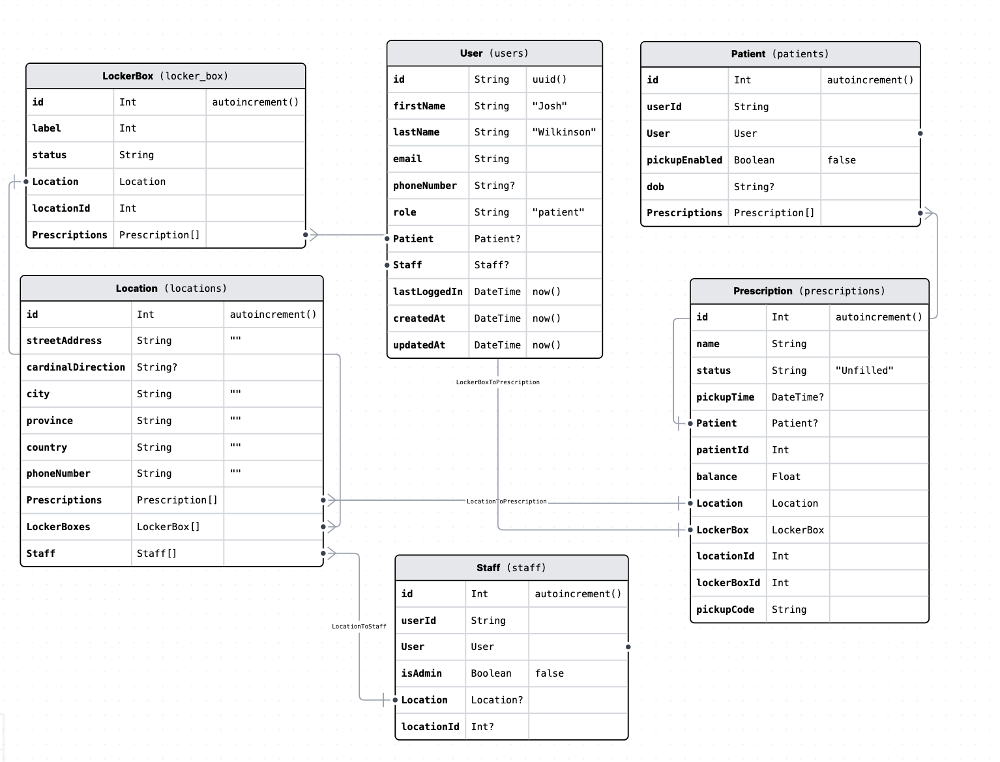
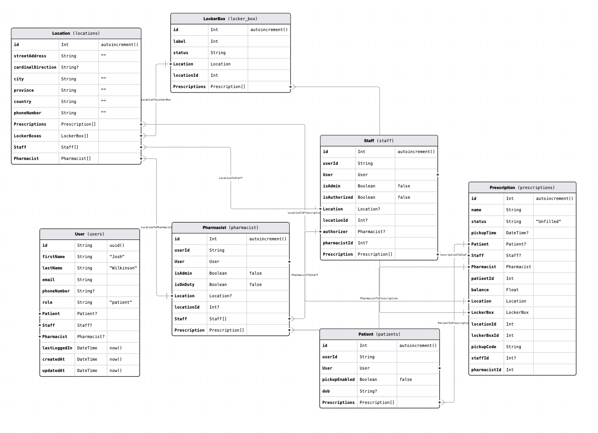

# Winter 2023, Week 5

## Proposed Data Schema Changes

Likert-scale user testing indicated that an SMS-based approach taking the onus off of the patient to maintain their
remote pickup profile is a critical user experience improvement. However even more critical is the requirement that a
licensed pharmacist grant working permissions to the pharmacy staff members involved in patient care; that is staff
members who would be using the system’s solution. While the team was aware of the regulatory framework during
our first design iteration phase, we were not aware of how it directly impacted the pharmacy workflow until I was able
to shadow operations at a pharmacy in recent weeks. What we quickly learned was that without such a permissions
structure, we were leaving a large security vulnerability in our system because we were unknowingly designing a system with no guard rails against operation without a licensed pharmacist on-site. The development of infrastructure

to prevent such a scenario is necessary to create a system that could be practically adoptable by operating community
pharmacies because the system would have the ability to effectively operate while under regulatory compliance. It
then stands to reason that without this engineering contribution and work, the project would experience significant
challenges in subsequent evaluative processes such as a pilot project or even in-pharmacy testing. It is for this reason
that this engineering contribution I will be working on is slated for our first design iteration of the term which is
currently projected to be completed on March 3rd, 2023.
While this engineering process may appear straightforward, in reality, it will add several layers of complexity to
both the application’s front-end design, as well as the authorization layer and relational database structure. The first
required change will be to that of the relational data model. The current data model utilizes a relational user-to-type
approach where a base model User stores universal information shared across all types of users such as name and
email, and relational Patient and Staff models handle patient and staff relationships, as shown in Figure 1.

Figure 1: Current PharmaBox Data Model [Image source: SRP, 2023]
We can see that the current model does not accommodate direct User to User relationships necessary to ensure
that each staff member who is not a pharmacist is working directly under a pharmacist at all times. To remedy this,
a proposed change is to add a field to the Staff model to allow an authorizer, to be set by a Pharmacist with
administrative permissions. A proposed draft schema is shown in Figure 2.

Figure 2: Proposed PharmaBox Data Model to Manage Staff Authorizations [Image source: SRP, 2023]
As shown in Figure 2, a pharmacist may grant, or revoke authorization to a staff member, in accordance with
regulations. This first draft of a data model still requires a pharmacist to manually grant or remove permissions
from a staff member. Should user testing and expert review suggest that the proposed approach ergonomically meets
regulatory requirements, further workflow optimizations could be made such as automatic authorization revoking
(such as at the end of a scheduled shift).

With an established data model complete, I (Sammy) will still need to make several complex changes to the front-end infrastructure as well as the service application program interface. Luckily, I (Sammy) previously established server-side rendering in the fall which will make this process significantly faster as well as more secure. Because we need only block staff
members from accessing patient care-related features we do not need to limit their ability to login to the application.
This allows staff members to retain some control, such as allowing them to change their profile information, or per-
form administrative tasks like adjusting member permissions or adding staff members to a Location (team) should
they have the correct permissions. In fact, this is feature is necessary to avoid race conditions that could arise if there
was no Pharmacist at a particular location. To avoid such a case, a staff member with administrative permissions
will always have the ability to add a new Pharmacist user to their Location but cannot authorize themselves. To
ensure that staff cannot create their own ”Pharmacist” and simply grant themselves permissions by logging into the
account, we will verify new account creation via a two-factor process and ensure unique identifiers like email and
phone numbers.
Since staff members will always have the ability to log in, it will be necessary to dynamically evaluate their au-
thorization status before rendering patient care content or features in the browser. With the previously implemented
server-side rendering, this can be done by intercepting incoming HTTP requests to the server and conditionally
returning content to the client’s browser based on the current user’s permissions. If the user is a Pharmacist they will always be able to view all features they have permission to access (it is possible to have a Pharmacist that is not
an administrator) for the first design iteration. If the user is a staff member, we will first check if their authorizer
is not null and if their authorizer is on duty. If the staff member has a valid authorizer, and the field on their Staff
model isAuthorized is true then they may view the content that they have permission to view. If isAuthorized
is false then change it to true and allow the staff member to proceed to patient content. Otherwise, do not render
the content and inform them that they are not authorized to view patient content.
There remains additional complexity for pharmacists when they log in to the application as they are required
to grant authorization to staff members, as well as revoke such authorization at the end of their working shift. To
facilitate this process, a pharmacist will have a team management console available to them via the web application.
From there they will be able to authorize or revoke authorization from non-pharmacist staff members. They will also
be able to transfer authorization to themselves from a different pharmacist. This will ease shift transitions between
pharmacists. Once the interface and data model has been created the system will be evaluated.
